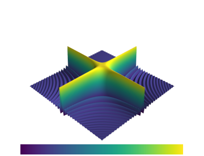

# Look-Up-Tables of the new colormaps in matplotlib 2.0 
For use of the matplotlib 2.0 colormaps in Mayavi 3D visualisation package
you need ``custom_colormap.py``.

How to use:

	import custom_colormap as cmap
	from mayavi import mlab
	
	surf = mlab.contour_surf(x,y,u)  #will use the default colormap
	surf.module_manager.scalar_lut_manager.lut.table = cmap._viridis_lut

# Viridis

	
 

